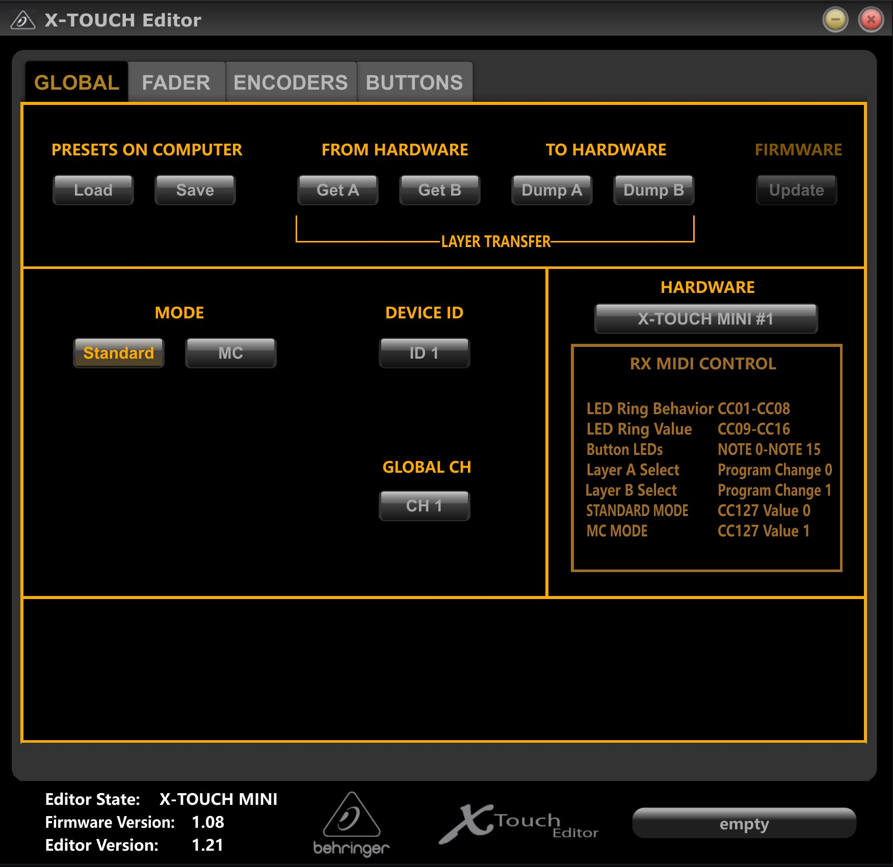

# X-Touch Presets
Presets for the Behringer X-Touch Mini

## Preset Directory
- [Adobe Audition](https://github.com/mackenly/xtouch-presets/tree/main/xtouch-mini/adobe-audition)
- Open to pull requests

## How To Use
1. Download X-TOUCH Editor: https://www.behringer.com/downloads.html
2. 🛑 Make sure to close any open programs that are using your X-Touch, then unzip and open the editor exe.
4. Using the editor (see screenshot below) load your choosen preset for layer A by selecting the "Load" button in the top left. Once you've selected the A layer file, press the "Dump A" button which is located to the right of the "Load" button we used earlier.
4. Repeat the same process as step 3 but instead do it for layer B.
5. You should be ready to go! If you want to revert your X-Touch you can factory reset or load in the layer files located in the "default layer" folder of the software download.

</img>
